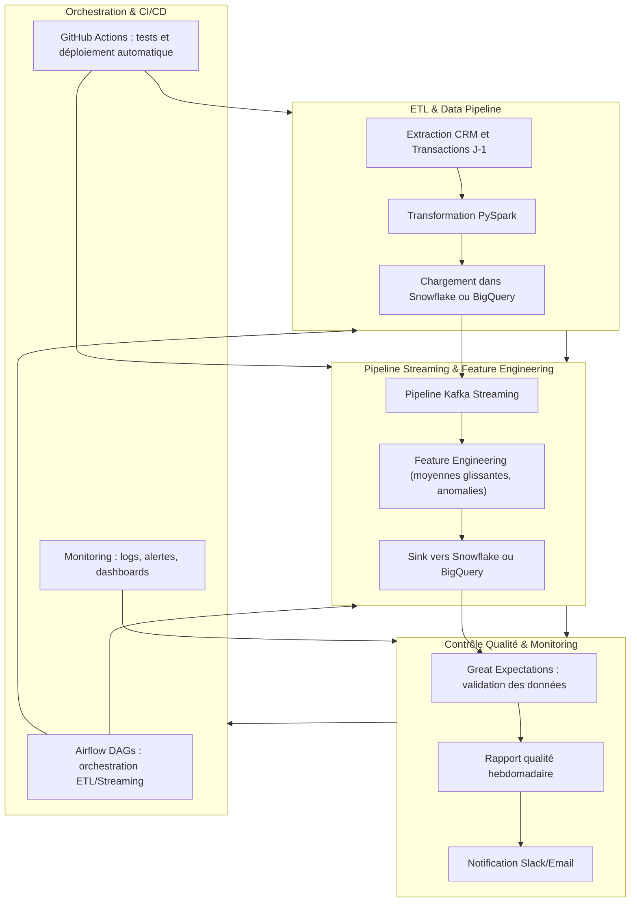

# 🗄️ plateforme de scoring fraude chargement vers Snowflake: 

Pipelines fiables pour l’ingestion et la transformation des données

## 🎯 Objectif
Mettre en place des pipelines **batch**, **streaming**, et de **qualité de données** afin d’assurer la fiabilité, la cohérence et la fraîcheur des données pour les analyses.

---
## 🔄 Pipeline global


---

## 🧩 Structure du Projet

```bash
fraud_scoring_platform/
├── dags/
│   ├── dag_batch_customers_transactions.py      # DAG Airflow pour le pipeline batch (extraction CRM + transactions J-1)
│   ├── dag_streaming_transactions.py            # DAG Airflow pour le pipeline streaming (transactions en temps réel)
│   └── dag_data_quality.py                      # DAG Airflow pour la validation et le reporting de la qualité
│
├── jobs/
│   ├── batch/
│   │   ├── extraction.py                        # Extraction des données CRM et transactions
│   │   ├── transform_pyspark.py                 # Nettoyage et transformation PySpark
│   │   └── load_warehouse.py                    # Chargement dans Snowflake / BigQuery
│   │
│   ├── streaming/
│   │   ├── streaming_job.py                     # Job Spark Structured Streaming avec Kafka
│   │   ├── feature_engineering.py               # Calcul des moyennes glissantes et détection d’anomalies
│   │   └── sink_snowflake.py                    # Écriture vers Snowflake / BigQuery
│   │
│   └── quality/
│       ├── great_expectations_checks.py         # Définition des règles Great Expectations
│       ├── generate_quality_report.py           # Génération du rapport de qualité hebdomadaire
│       └── notify_quality_status.py             # Notification (Slack/Email)
│
├── configs/
│   ├── airflow_config.yaml                      # Configuration Airflow (connexions, scheduling)
│   ├── spark_config.yaml                        # Configuration Spark (batch et streaming)
│   ├── warehouse_config.yaml                    # Connexions Snowflake/BigQuery
│   └── quality_rules.yaml                       # Règles de validation de la qualité des données
│
├── utils/
│   ├── logger.py                                # Gestion des logs centralisés
│   ├── monitoring.py                            # Suivi de la latence et métriques
│   ├── schema_validation.py                     # Validation de schéma Avro/Parquet
│   └── helpers.py                               # Fonctions utilitaires génériques
│
├── reports/
│   ├── data_quality_report.html                 # Rapport généré automatiquement par Great Expectations
│   └── metrics_dashboard.csv                    # Indicateurs de qualité et volumétrie
│
├── tests/
│   ├── test_batch_pipeline.py                   # Tests unitaires du pipeline batch
│   ├── test_streaming_pipeline.py               # Tests du pipeline temps réel
│   └── test_data_quality.py                     # Tests des règles de validation
│
├── Dockerfile                                   # Image Airflow + Spark + GE
├── requirements.txt                             # Dépendances Python
└── README.md
```
---
## ⚙️ Stack Technique
- **Orchestration** : Apache Airflow
- **Traitement batch** : PySpark
- **Traitement temps réel** : Spark Structured Streaming + Kafka
- **Stockage analytique** : Snowflake / BigQuery
- **Qualité des données** : Great Expectations
- **Monitoring** : Airflow + Logs + Metrics

## 🚀 Exécution

```bash
# Lancer Airflow
docker-compose up airflow-webserver airflow-scheduler

# Déclencher le DAG batch manuellement
airflow dags trigger dag_batch_customers_transactions

# Visualiser le rapport de qualité
open reports/data_quality_report.html

```