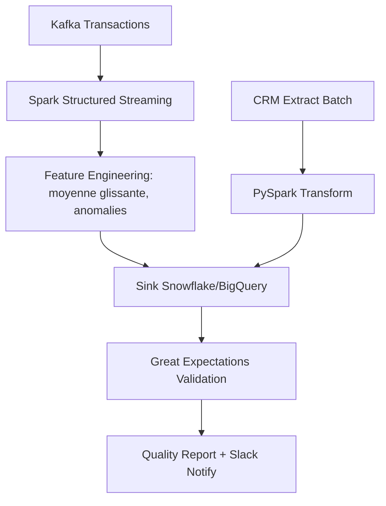

# Documentation du projet Fraud Scoring Platform (Module 2)
---
## 🚀 Data Platform – Pipelines Batch, Streaming et Qualité des Données

Ce projet implémente une plateforme complète de pipelines **Airflow + Spark + Great Expectations**, intégrant :
- Traitement **batch** (données CRM + transactions J-1)
- Traitement **streaming** en temps réel (Kafka → Snowflake/BigQuery)
- Validation et **monitoring de la qualité des données**

---

## 📂 Structure du Projet

```bash
data_pipeline_project/
├── dags/
│   ├── dag_batch_customers_transactions.py
│   ├── dag_streaming_transactions.py
│   └── dag_data_quality.py
├── jobs/
│   ├── extraction.py
│   ├── transform_pyspark.py
│   ├── load_warehouse.py
│   ├── streaming_job.py
│   ├── feature_engineering.py
│   ├── sink_snowflake.py
│   ├── great_expectations_checks.py
│   ├── generate_quality_report.py
│   └── notify_quality_status.py
├── configs/
│   ├── airflow_config.yaml
│   ├── spark_config.yaml
│   ├── warehouse_config.yaml
│   └── quality_rules.yaml
├── utils/
│   ├── logger.py
│   ├── monitoring.py
│   ├── schema_validation.py
│   └── helpers.py
├── tests/
│   ├── test_batch_pipeline.py
│   ├── test_streaming_pipeline.py
│   └── test_data_quality.py
├── Dockerfile
├── requirements.txt
└── README.md
```

---

## ⚙️ Installation et Lancement

### 1️⃣ Cloner le dépôt

```bash
git clone https://github.com/your-org/data-pipeline-project.git
cd data-pipeline-project
```

### 2️⃣ Construire et lancer les conteneurs

```bash
docker-compose up --build
```

### 3️⃣ Démarrer Airflow

Airflow sera disponible à l’adresse :  
👉 `http://localhost:8080`  
Login par défaut : `airflow / airflow`

### 4️⃣ Lancer les DAGs

Dans l’interface Airflow :
- `dag_batch_customers_transactions` : pipeline batch quotidien  
- `dag_streaming_transactions` : pipeline streaming Kafka  
- `dag_data_quality` : vérification et rapport qualité hebdomadaire  

### 5️⃣ Vérifier les logs et métriques

Logs disponibles dans `/logs/`  
Métriques consultables via **Prometheus / Grafana**

---

## 📘 Documentation Technique

### 🔹 Pipelines

| Type | Description | Techno |
|------|--------------|--------|
| Batch | Extraction et transformation PySpark | Airflow + Spark |
| Streaming | Transactions Kafka + Feature Engineering | Spark Structured Streaming |
| Data Quality | Règles Great Expectations + Rapport hebdo | GE + Airflow |

### 🔹 Configurations

- `configs/airflow_config.yaml` : planification et connexions Airflow  
- `configs/spark_config.yaml` : paramètres Spark (batch + streaming)  
- `configs/warehouse_config.yaml` : credentials Snowflake / BigQuery  
- `configs/quality_rules.yaml` : règles de validation des données  

---

## 🧪 Tests

Exécution des tests unitaires :

```bash
pytest tests/ --disable-warnings -v
```

---

## 🧱 Dockerfile (extrait)

```Dockerfile
FROM apache/airflow:2.9.0-python3.9

RUN pip install --no-cache-dir -r requirements.txt
COPY . /opt/airflow/
ENV PYTHONPATH=/opt/airflow
```

---

## 📈 Monitoring

- **Latence streaming** mesurée via `monitoring.py`
- **Logs centralisés** dans `/logs` avec rotation automatique
- **Alertes Slack/Email** via `notify_quality_status.py`

---

## 📊 Exemple de Diagramme Mermaid



---

## 👨‍💻 Auteurs

- **Data Engineer** : Salim Majide  
- **Stack utilisée** : Airflow, Spark, Kafka, Snowflake, Great Expectations

---

## 🏁 Commandes rapides

```bash
# Démarrer tout
docker-compose up -d

# Lancer un DAG spécifique
airflow dags trigger dag_batch_customers_transactions

# Vérifier les logs
docker logs airflow-scheduler

# Exécuter les tests
pytest tests/
```

---

## 📚 Références

- [Apache Airflow](https://airflow.apache.org/)
- [Apache Spark](https://spark.apache.org/)
- [Great Expectations](https://greatexpectations.io/)
- [Snowflake Documentation](https://docs.snowflake.com/)
- [Google BigQuery](https://cloud.google.com/bigquery)